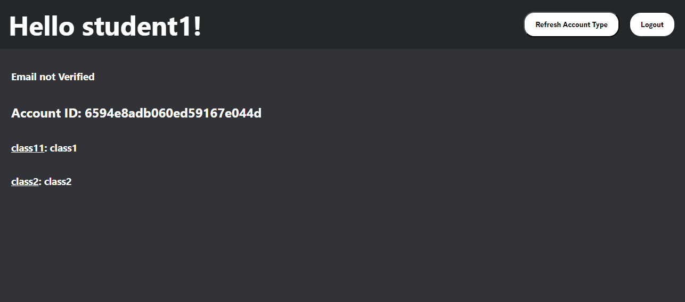
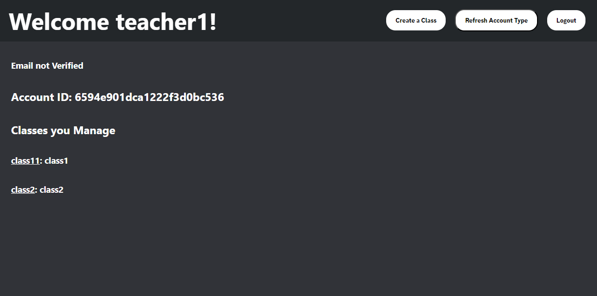
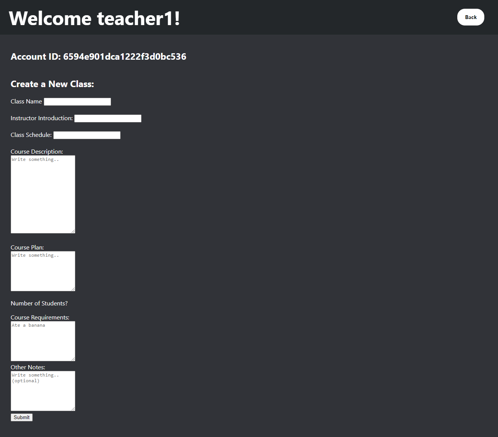
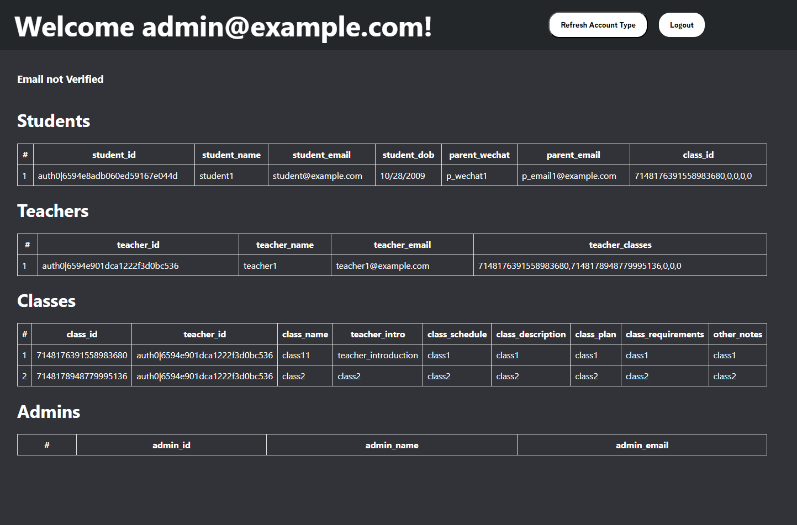
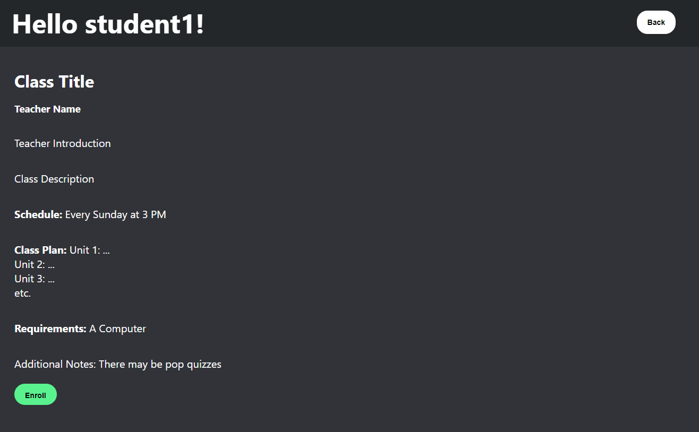
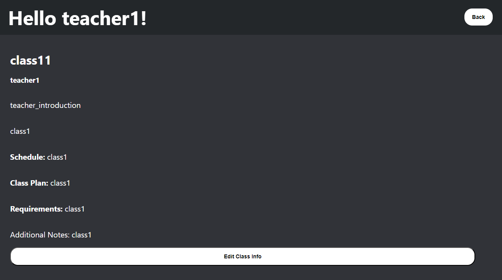

# Website Example
http://54.176.19.164:443

# Initial Sign Up 
After creating an account, you will be prompted to enter your information. After entering your information, you will see your [`Account ID`](#account-id) and a list of the [classes](#classes) made by [teachers](#account-types).

# Account ID

The Account ID on the main page is used to manually change user's [account types](#account-types). I (currently) alone can change the account types of people. So, if a teacher is told about the website, I will get their Account ID and make their account a teacher account.

# Account Types

There are three account types, each with different abilities.

- Student
  - Students can see and click on the classes shown at the bottom, then at the bottom of the classes page they can enroll in the class.

- Teacher
  - Teachers can create classes, and can also see a list of all the classes they own (and therefore can edit), and all the classes they can't edit. On the classes they created, they can change information about the class. (Seeing the student roster and information have not been implemented yet)

- Admin
  - Admins can view everyone's information as well as what classes the students are in. (Changing information and sorting/searching have not been implemented yet)

# Classes

Each class, after being created by a teacher, has a class page. This page contains all the information for a class, as well as a button to enroll in the class. Right now, there is no class page once you are enrolled in the class.

For teachers, you can edit the class if you own the class.

# Example Accounts

### Student Account

Email: student@example.com
Password: ydrc_US!

### Teacher Account

Email: teacher1@example.com
Password: ydrc_US!

### Admin Account

Email: admin@example.com
Password: ydrc_US!

# "Refresh Account Type"

This button at the top right of every account's page is only used for changing someone's account type. After I manually change a user's account type, they are supposed to press the button. That is why there is no explanation for the button on the website.
